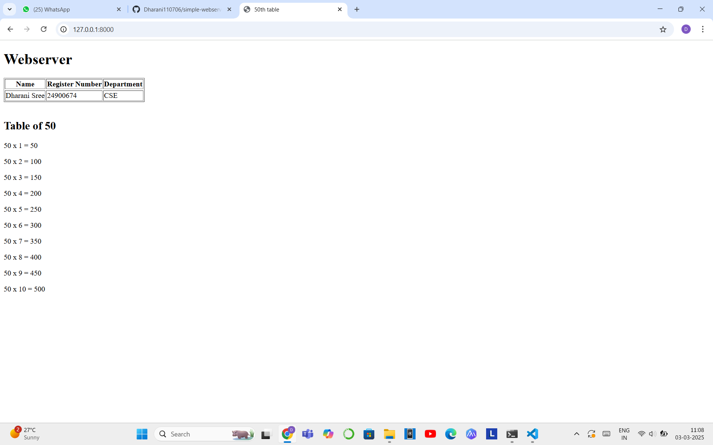

 
# EX01 Developing a Simple Webserver
## Date:

## AIM:
To develop a simple webserver to serve html pages and display the configuration details of laptop.

## DESIGN STEPS:
### Step 1: 
HTML content creation.

### Step 2:
Design of webserver workflow.

### Step 3:
Implementation using Python code.

### Step 4:
Serving the HTML pages.

### Step 5:
Testing the webserver.

## PROGRAM:
```html
<!DOCTYPE html>
<html lang="en">
<head>
    <meta charset="UTF-8">
    <meta name="viewport" content="width=device-width, initial-scale=1.0">
    <title>50th table</title>
</head>
<body>
    <h1>Webserver</h1>
    <table border="1">
        <tr>
            <th>Name</th>
            <th>Register Number</th>
            <th>Department</th>
        <tr>
        <tr>
            <td>Dharani Sree</td>
            <td>24900674</td>
            <td>CSE</td>
        
    </table>
    <br>
    <h2>Table of 50</h2>
    <p>50 x 1 = 50</p>
    <p>50 x 2 = 100</p>
    <p>50 x 3 = 150</p>
    <p>50 x 4 = 200</p>
    <p>50 x 5 = 250</p>
    <p>50 x 6 = 300</p>
    <p>50 x 7 = 350</p>
    <p>50 x 8 = 400</p>
    <p>50 x 9 = 450</p>
    <p>50 x 10 = 500</p>   
</body>
</html>
```

## OUTPUT:


## RESULT:
The program for implementing simple webserver is executed successfully.
